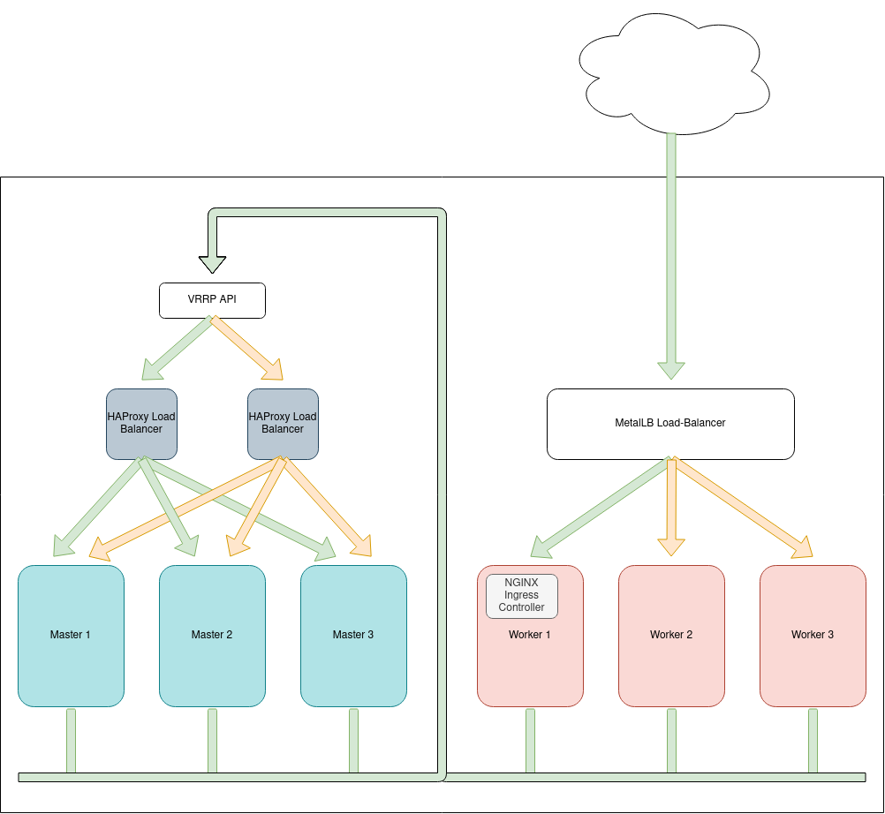

# Bare Metal Kubernetes Cluster Setup

1. [Configuring API High Availability](HA-API)
2. [Provisioning a Bare Metal Cluster](Bare-Metal-Provision)
3. [Configuring a Bare Metal Load Balancer](MetalLB)
4. [Configuring an Ingress Controller with SSL](nginx-ingress)
5. [Configuring the Kubernetes Dashboard with Metrics](Dashboard)
